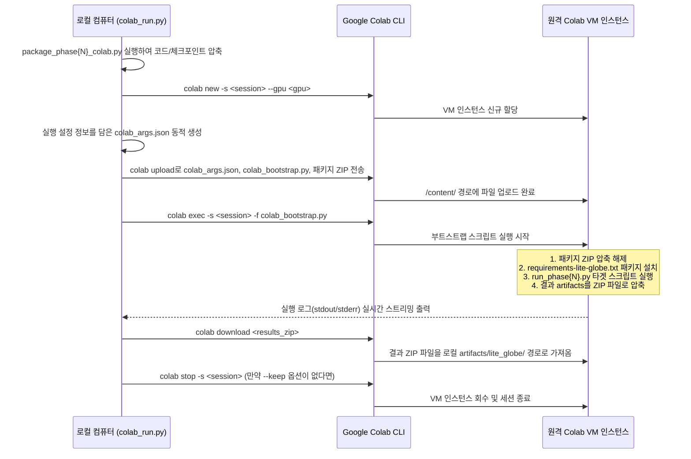

# Google Colab CLI 통합 가이드

이 가이드는 공식 Google Colab CLI (`google-colab-cli`)를 사용하여 로컬 터미널에서 Google Colab으로 Lite-GLOBE 환경 단계 및 정책 학습/평가를 직접 실행하는 방법을 설명합니다.

이 가이드에 따라 구축된 자동화 스크립트를 사용하면 **코드 패키징 → 원격 GPU/TPU 인스턴스 할당 → 워크스페이스 업로드 → 원격 의존성 설치 → 코드 실행 → 결과물 다운로드 → 인스턴스 종료**의 전체 워크플로우가 단 하나의 명령어로 자동화됩니다.

---

## 1. 사전 준비 사항

### 1단계: 패키지 설치
Google Colab CLI 라이브러리는 이미 프로젝트의 `requirements.txt`에 추가되어 있습니다. 로컬 가상 환경이 활성화되어 있는지 확인한 후 아래 명령어로 의존성을 업데이트해 주세요.

```bash
cd ResearchAIWorkspace
source .venv/bin/activate
pip install -r requirements.txt
```

### 2단계: Google Colab 계정 인증 (처음 1회 필수)
CLI 도구가 사용자의 Google Colab 계정에 접근하여 인스턴스를 관리할 수 있도록 로그인 인증을 수행합니다.

```bash
colab auth login
```

이 명령어를 실행하면 브라우저 창이 열리며 Google 계정 로그인을 요청합니다. Colab 요금제나 GPU 권한이 있는 계정으로 로그인해 주세요. 인증 토큰은 로컬 PC의 `~/.config/colab-cli/` 경로에 안전하게 저장됩니다.

> [!TIP]
> 만약 터미널에서 브라우저를 띄울 수 없는 환경(비대화형 에이전트나 서버 환경)이라면, Google Cloud SDK의 ADC(Application Default Credentials) 방식을 사용하는 것이 가장 안정적입니다.
> ```bash
> gcloud auth application-default login \
>   --scopes=openid,\
> https://www.googleapis.com/auth/cloud-platform,\
> https://www.googleapis.com/auth/userinfo.email,\
> https://www.googleapis.com/auth/colaboratory
> ```

---

## 2. 실험 실행 방법

로컬에서 전체 실행 흐름을 제어하는 오케스트레이터 스크립트인 `scripts/colab_run.py`를 사용합니다.

### 명령어 옵션 확인
`python scripts/colab_run.py --help`를 실행하면 지원하는 모든 옵션을 확인할 수 있습니다.

| 옵션 | 타입 | 기본값 | 설명 |
|---|---|---|---|
| `--phase` | int | `13` | 패키징하고 Colab에서 실행할 Lite-GLOBE 단계 번호 (예: 10, 13) |
| `--gpu` | str | `T4` | 할당할 GPU 사양 (`T4`, `L4`, `G4`, `H100`, `A100`) |
| `--tpu` | str | `None` | 할당할 TPU 사양 (`v5e1`, `v6e1`). 설정 시 `--gpu`를 덮어씁니다. |
| `--cpu` | flag | `False` | GPU/TPU 가속기 없이 CPU 전용 인스턴스로 실행 |
| `--session` | str | `None` | Colab 세션 이름 (지정하지 않으면 `colab-routing-phase<phase>`로 자동 설정) |
| `--smoke` | flag | `False` | 스모크 테스트 모드로 실행 (적은 에피소드로 빠르게 실행 상태만 검증) |
| `--keep` | flag | `False` | 실행 완료 후에도 Colab 인스턴스를 종료하지 않고 유지 (원격 디버깅 시 유용) |

### 실행 예시

#### 1. Phase 13 스모크 테스트 실행 (기본 T4 GPU 사용)
캘리브레이션된 Risk-Switch Lite-GLOBE-P+가 Colab에서 정상 동작하는지 검증합니다.
```bash
python scripts/colab_run.py --phase 13 --smoke
```

#### 2. Phase 13 전체 평가 실행 (기본 T4 GPU 사용)
Colab에서 Phase 13의 모든 에피소드 실험을 완주하고 결과 zip 파일을 자동으로 로컬로 가져옵니다.
```bash
python scripts/colab_run.py --phase 13
```

#### 3. 고성능 A100 GPU에서 Phase 10 전체 평가 실행
```bash
python scripts/colab_run.py --phase 10 --gpu A100
```

#### 4. 저비용으로 CPU만 사용하여 Phase 10 스모크 테스트 실행
```bash
python scripts/colab_run.py --phase 10 --cpu --smoke
```

---

## 3. 내부 동작 방식

`scripts/colab_run.py` 스크립트는 내부적으로 다음과 같이 흐름을 조율합니다.



1. **로컬 패키징**: `scripts/package_phase{N}_colab.py`를 호출하여 코드, 연산용 체크포인트, 테스트 코드 등을 하나로 묶은 `artifacts/lite_globe/phase{N}_colab_bundle.zip`을 만듭니다.
2. **세션 활성화**: 설정한 세션 이름(`colab-routing-phase{N}`)의 인스턴스가 Colab 백엔드에 켜져 있는지 확인합니다. 꺼져 있다면 새 인스턴스를 즉시 Provisioning(할당)합니다.
3. **파일 전송 (Upload)**: 원격 VM의 작업 폴더인 `/content/` 경로에 3가지 핵심 파일을 업로드합니다.
   - `colab_args.json`: 원격 실행 명령어, 파라미터, 저장 경로 등 메타데이터 정보
   - `colab_bootstrap.py`: 인스턴스 내부의 설치 및 실행 흐름을 대행하는 원격 부트스트랩 스크립트
   - `phase{N}_colab_bundle.zip`: 업로드할 코드 및 가중치 파일 패키지
4. **원격 부트스트랩 실행**: Colab 커널에 `colab_bootstrap.py`를 실행하도록 요청합니다. 부트스트래퍼는 ZIP을 풀고, 패키지를 빌드하고, 타겟 모듈을 실행한 후 결과 폴더를 zip으로 압축합니다.
5. **결과 복사 (Download)**: 원격에서 최종 생성된 결과 압축 파일(`phase{N}_results.zip`)을 로컬 PC의 `artifacts/lite_globe/` 경로로 즉시 다운로드합니다.
6. **세션 종료**: 불필요한 과금(컴퓨팅 단위 소모)을 막기 위해 사용이 끝난 VM을 즉시 정지시킵니다. (단, `--keep` 플래그를 준 경우 인스턴스를 살려둡니다.)

---

## 4. 유용한 팁 및 문제 해결

### 1. 중단된 실험 재개하기
실행 도중 연결이 끊어졌거나 재실행해야 하는 경우, 기존 세션 이름을 그대로 지정하고 다시 실행하세요. `colab_run.py`는 동일한 이름의 활성 세션을 감지하면 VM 할당 단계를 건너뛰고 기존 VM 내에서 작업을 수행합니다.

### 2. 활성 세션 상태 보기
현재 계정에서 실행 중인 모든 VM 인스턴스 정보를 나열합니다.
```bash
colab sessions
```

### 3. 방치된 인스턴스 수동 종료하기
인스턴스가 켜져 있으면 지속적으로 컴퓨팅 단위가 차감됩니다. 더 이상 쓰지 않는 세션은 반드시 수동으로 꺼주세요.
```bash
colab stop -s colab-routing-phase13
```

### 4. 실행 에러 로그 확인하기
스크립트 실행 중 에러가 발생한 경우 백엔드 상세 로그를 불러와 분석할 수 있습니다.
```bash
colab log -s colab-routing-phase13
```
